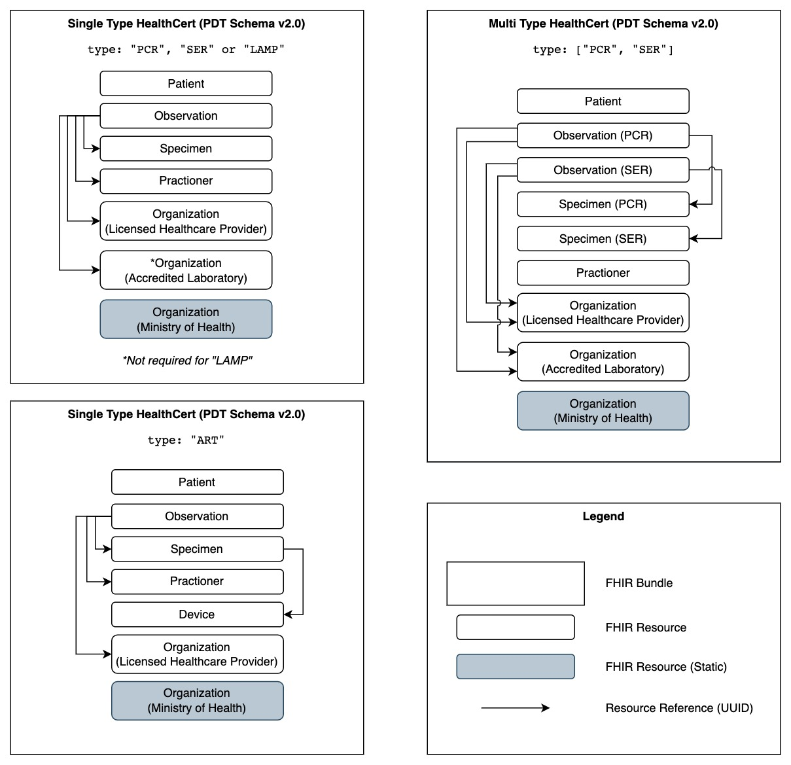

# 1. Compose and validate fhirBundle

The `fhirBundle` is a collection of FHIR resources. Each resource and the entire bundle should be compliant against the base spec of FHIR.

The PDT HealthCert v2.0 requires the following resources to be present:

1. Patient
2. Specimen (`device` should reference [^2]Device resource uuid)
3. Observation (`specimen` should reference Specimen resource uuid + `performer` should reference Practitioner, Organization (LHP) & [^1]Organization (AL) resource uuid)
4. Practitioner (`issuer` should reference to Observation (MOH) resource uuid)
5. Organization (MOH)
6. Organization (Licensed Healthcare Provider)
7. [^1]Organization (Accredited Laboratory)
8. [^2]Device

[^1]: Organisation (AL) is not needed for ART HealthCerts
[^2]: Device resource is only needed for ART HealthCerts

## How to compose fhirBundle

The `fhirBundle` can be easily composed using the following examples found here: https://github.com/Notarise-gov-sg/api-notarise-healthcerts/tree/master/test/fixtures/v2 (You may refer to `fhirBundle` in `pdt_pcr_with_nric_unwrapped.json` for easy readability)

**FHIR Bundle (Represented as a diagram)**
To provide a better understanding, this diagram provides a simplified overview of each `type` of PDT HealthCert (e.g. `"PCR"`, `"ART"`, `["PCR", "SER"]`). The arrows describe how each resource is linked via the resource UUID (refer to the **Mapping Table** below).

[Source file](./images/fhir-bundle-diagram.drawio)

> **Note**: If a provider intends to add additional properties or resources, they would have ensure the added fields complies to the base spec of FHIR.

## How to validate fhirBundle

There are 2 types of validations: **Base Spec Validation** and "**Required Fields Validation**"

### 1. FHIR Base Spec Validation

- [x] [FHIR parser](https://github.com/Notarise-gov-sg/api-notarise-healthcerts/pull/216) by @HJunyuan: Validate against FHIR base spec and extract fields from FHIR resources. If not, throw errors.

FHIR Base Spec Validation ensures the structure, cardinality, values, bindings, etc of the a FHIR resource. This is different from JSON Schema validators where Coding/CodeableConcept bindings cannot be validated. Refer to [documentation](https://www.hl7.org/fhir/validation.html) for more info.

Recommended FHIR validators:

- GUI (Select R4): [https://simplifier.net/validate](https://simplifier.net/validate)
- GUI: [https://inferno.healthit.gov/validator/](https://inferno.healthit.gov/validator/)
- FHIR.js: [https://www.npmjs.com/package/fhir](https://www.npmjs.com/package/fhir)
- Others: [https://confluence.hl7.org/display/FHIR/Open+Source+Implementations](https://confluence.hl7.org/display/FHIR/Open+Source+Implementations)

> **Note**: Since the entire bundle consists of multiple resources, it is recommended to validate each resource first, before validating the entire bundle.

### 2. Required Fields Validation

Ensure that the `fhirBundle` has the required fields for Notarise endorsement depicted in the "Required" column of the following [mapping table](#mapping-table).

## Mapping Table

<table>
<thead>
  <tr>
    <th>Meta</th>
    <th>FHIR Mapping</th>
    <th>Required</th>
  </tr>
</thead>
<tbody>
  <tr>
    <td colspan="3" align="center"><b>Patient</b></td>
  </tr>
  <tr>
    <td>Patient Full Name</td>
    <td>Patient.name[0].text</td>
    <td>Yes</td>
  </tr>
  <tr>
    <td>Gender</td>
    <td>Patient.gender</td>
    <td>Optional - Recommended</td>
  </tr>
  <tr>
    <td>Birth Date (YYYY-MM-DD)</td>
    <td>Patient.birthDate</td>
    <td>Yes</td>
  </tr>
  <tr>
    <td>Nationality (2-letter ISO 3166 code)</td>
    <td>Patient.extension[0].extension[url=code].valueCodeableConcept.coding[0].{ system, code }</td>
    <td>Yes</td>
  </tr>
  <tr>
    <td>Passport Number</td>
    <td>Patient.identifier[0].{ id=PPN, type, value }</td>
    <td>Yes</td>
  </tr>
  <tr>
    <td>NRIC or FIN</td>
    <td>Patient.identifier[1].{ id=NRIC-FIN, value }</td>
    <td>Yes - If known</td>
  </tr>
  <tr>
    <td colspan="3" align="center"><b>Observation(s)</b></td>
  </tr>
  <tr>
    <td>Specimen Resource Reference (UUID)</td>
    <td>Observation.specimen.{ type=Specimen, reference }</td>
    <td>Yes</td>
  </tr>
  <tr>
    <td>Practitioner Resource Reference (UUID)</td>
    <td>Observation.performer[0].{ type=Practitioner, reference }</td>
    <td>Yes</td>
  </tr>
  <tr>
    <td>Organization (LHP) Resource Reference (UUID)</td>
    <td>Observation.performer[1].{ id=LHP, type=Organization, reference }</td>
    <td>Yes</td>
  </tr>
  <tr>
    <td>Organization (AL) Resource Reference (UUID)</td>
    <td>Observation.performer[2].{ id=AL, type=Organization, reference }</td>
    <td>PCR HealthCerts only</td>
  </tr>
  <tr>
    <td>ASCN</td>
    <td>Observation.identifier[0].{ id=ACSN, value }</td>
    <td>Yes</td>
  </tr>
  <tr>
    <td>Target Disease</td>
    <td>Observation.category[0].coding[0].{ system, code, display }</td>
    <td>Yes</td>
  </tr>
  <tr>
    <td>Type of Test</td>
    <td>Observation.code.coding[0].{ system, code, display }</td>
    <td>Yes</td>
  </tr>
  <tr>
    <td>Test Result</td>
    <td>Observation.valueCodeableConcept.coding[0].{ system, code, display }</td>
    <td>Yes</td>
  </tr>
  <tr>
    <td>iModality</td>
    <td>Observation.note[0].{ id=MODALITY, text }</td>
    <td>ART HealthCerts only</td>
  </tr>
  <tr>
    <td>Effective datetime (ISO 8601 timestamp)</td>
    <td>Observation.effectiveDateTime</td>
    <td>Yes</td>
  </tr>
  <tr>
    <td>Status</td>
    <td>Observation.status</td>
    <td>Yes</td>
  </tr>
  <tr>
    <td colspan="3" align="center"><b>Specimen(s)</b></td>
  </tr>
  <tr>
    <td>Device Resource Reference (UUID)</td>
    <td>Specimen.subject.{ type=Device, reference }</td>
    <td>ART HealthCerts only</td>
  </tr>
  <tr>
    <td>Type of Swab</td>
    <td>Specimen.type.coding[0].{ system, code, display }</td>
    <td>Yes</td>
  </tr>
  <tr>
    <td>Collection datetime (ISO 8601 timestamp)</td>
    <td>Specimen.collection.collectedDateTime</td>
    <td>Yes</td>
  </tr>
  <tr>
    <td colspan="3" align="center"><b>Practitioner</b></td>
  </tr>
  <tr>
    <td>Practitioner Full Name</td>
    <td>Practitioner.name[0].text</td>
    <td>Yes</td>
  </tr>
  <tr>
    <td>Practitioner Medicare number</td>
    <td>Practitioner.qualification[0].identifier[0].{ id=MCR, value }</td>
    <td>Yes</td>
  </tr>
  <tr>
    <td>Organization (MOH) Resource Reference (UUID)</td>
    <td>Practitioner.qualification[0].issuer.{ type=Organization, reference }</td>
    <td>Yes</td>
  </tr>
  <tr>
    <td colspan="3" align="center"><b>Organization (MOH)</b></td>
  </tr>
  <tr>
    <td>Organization Full Name</td>
    <td>Organization.name</td>
    <td>Yes</td>
  </tr>
  <tr>
    <td>Organization Type</td>
    <td>Organization.type[0].coding[0].{ system, code, display }</td>
    <td>Yes</td>
  </tr>
  <tr>
    <td>Organization URL</td>
    <td>Organization.contact[0].telecom[0].{ system=url, value }</td>
    <td>Yes</td>
  </tr>
  <tr>
    <td>Organization Phone</td>
    <td>Organization.contact[0].telecom[1].{ system=phone, value }</td>
    <td>Yes</td>
  </tr>
  <tr>
    <td>Organization Address</td>
    <td>Organization.contact[0].address.{ type, use, text }</td>
    <td>Yes</td>
  </tr>
  <tr>
    <td colspan="3" align="center"><b>Organization (Licensed Healthcare Provider)</b></td>
  </tr>
  <tr>
    <td>Organization Full Name</td>
    <td>Organization.name</td>
    <td>Yes</td>
  </tr>
  <tr>
    <td>Organization Type Text</td>
    <td>Organization.type[0].text="Licensed Healthcare Provider"</td>
    <td>Yes</td>
  </tr>
  <tr>
    <td>Organization Type</td>
    <td>Organization.type[0].coding[0].{ system, code, display }</td>
    <td>Yes</td>
  </tr>
  <tr>
    <td>Organization URL</td>
    <td>Organization.contact[0].telecom[0].{ system=url, value }</td>
    <td>Yes</td>
  </tr>
  <tr>
    <td>Organization Phone</td>
    <td>Organization.contact[0].telecom[1].{ system=phone, value }</td>
    <td>Yes</td>
  </tr>
  <tr>
    <td>Organization Address</td>
    <td>Organization.contact[0].address.{ type, use, text }</td>
    <td>Yes</td>
  </tr>
  <tr>
    <td colspan="3" align="center"><b>Organization (Accredited Laboratory) [PCR HealthCerts only]</b></td>
  </tr>
  <tr>
    <td>Organization Full Name</td>
    <td>Organization.name</td>
    <td>PCR HealthCerts only</td>
  </tr>
  <tr>
    <td>Organization Type Text</td>
    <td>Organization.type[0].text="Accredited Laboratory"</td>
    <td>PCR HealthCerts only</td>
  </tr>
  <tr>
    <td>Organization Type</td>
    <td>Organization.type[0].coding[0].{ system, code, display }</td>
    <td>PCR HealthCerts only</td>
  </tr>
  <tr>
    <td>Organization URL</td>
    <td>Organization.contact[0].telecom[0].{ system=url, value }</td>
    <td>PCR HealthCerts only</td>
  </tr>
  <tr>
    <td>Organization Phone</td>
    <td>Organization.contact[0].telecom[1].{ system=phone, value }</td>
    <td>PCR HealthCerts only</td>
  </tr>
  <tr>
    <td>Organization Address</td>
    <td>Organization.contact[0].address.{ type, use, text }</td>
    <td>PCR HealthCerts only</td>
  </tr>
  <tr>
    <td colspan="3" align="center"><b>Device [ART HealthCerts only]</b></td>
  </tr>
  <tr>
    <td>Device Type</td>
    <td>Device.type.coding[0].{ system, code, display }</td>
    <td>ART HealthCerts only</td>
  </tr>
</tbody>
</table>

> i**Modality**: Accepted text are "Administered", "Supervised" or "Remotely Supervised"
